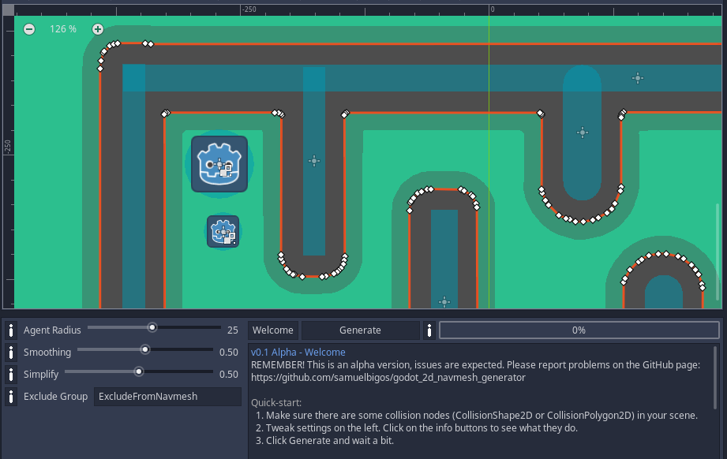

# Godot 2D Navmesh Generator



A tool for generating a navigation mesh from collision data in a 2D scene. Implemented and tested in Godot 3.2.3.

PRs are welcome, no guarantees on a swift review though.

## Installation

If your Godot project is tracked with Git, it is recommended to install this as a [Git submodule](https://git-scm.com/book/en/v2/Git-Tools-Submodules). This means you can easily pull down updates. From your project root:

```
git submodule add https://github.com/samuelbigos/godot_2d_navmesh_generator addons/godot_2d_navmesh_generator
```

If you're not tracking on Git, download the repo and place into the 'addons/godot_2d_navmesh_generator' directory.

## Usage

1. Add a _NavigationPolygonInstance_ to your scene ([see documentation](https://docs.godotengine.org/en/stable/classes/class_navigation2d.html)).
2. In the Inspector menu, add a new _NavigationPolygon_ and make sure it's selected.
3. In the bottom panel you should see a tab _NavmeshGen_. Click it.
4. Use this menu to generate a mesh for your _NavigatonPolygon_.

## Demo

A demo project is included (_2d_navmesh_generator_demo.zip_), it includes basic navmesh agent and some collision shapes to generate a navmesh from.

## Known Issues and Gotchas

- 'Holes' in topology are not supported (yet). This means if you have a donut shape, the hole will be filled in. The solution for now is to leave a gap somewhere (and make it big enough for your agent width), then fill in the gap manually.
- After generating, re-select the NavigationPolygonInstance node a few times in the editor to bring up the polygon editing interface.
- Settings are not saved and will reset to default when re-selecting the node.
- Generation time cost increases with square of scene size, which can be unoptimal for large scenes. Try and split your scenes up into multiple navmeshes if possible.
- Works better if most straight lines are axis-aligned. This is because the scene is rasterized before being converted to a mesh, and diagonal lines introduce aliasing.
- Only tested on Godot 3.2.3 and GLES3, might not work on other versions.
   
## Next Steps

- Fix known issues.
- Create an API to generate programatically (for procedurally generated scenes).
- Port to GDNative for performance.
- Clean up and properly comment code.
- Suggestions welcome!

## Changelog

### v0.1: Initial release for Godot 3.2.3

- Initial release.